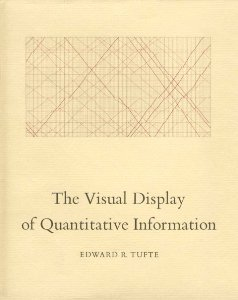

# How many times has each team won the World Series?
## Using the SeriesPost table in the Lahman data package

Using the Major League Baseball data contained within the `Lahman` __R__ data package, this code applies functions in the packages `dplyr` and `ggplot2` to create a table and plot that show the total number of World Series wins by each team and franchise.

```{r, message=FALSE}

library(Lahman)

data(SeriesPost)
head(SeriesPost)
tail(SeriesPost)

```

## How many World Series has each _team_ won?

Using the data manipulation package `dplyr`, produce a crude summary table.

Notes: 
 - SeriesPost only includes an identifier for the team (teamID), but not the franchise (e.g. the Brooklyn Dodgers and Los Angeles Dodgers are counted separately)
 - The World Series began in 1903 [see Wikipedia entry](https://en.wikipedia.org/wiki/World_Series), but the Lahman data tables have the final round of the earlier playoffs labelled "WS", so it is necessary to filter the SeriesPost table to exclude years prior to 1903.


```{r, message=FALSE}

library(dplyr)

ws_winner_table <- SeriesPost %>%
  mutate(teamIDwinner = as.character(teamIDwinner)) %>%
  filter(yearID > "1902", round == "WS") %>%
  group_by(teamIDwinner) %>%
  summarise(wincount = n()) %>%
  arrange(desc(wincount))

ws_winner_table


```

## How many World Series has each _franchise_ won?

Using the data tables `Teams` and `TeamsFranchises`, build a new table that contains both 'teamID' and 'franchiseID'.

Note:
- the 'teamID' and 'franchiseID' variables only exist together in the `Teams` table.

```{r}

# Create table of current franchises and their names
data("TeamsFranchises")
active_teams <- TeamsFranchises %>% 
  subset(active == "Y") %>%
  mutate(franchID = as.character(franchID)) %>%
  select(franchID, franchName)
active_teams
#
# create a list of the team IDs
data("Teams")
team_ID_list <- Teams %>%
  filter(yearID > 1900, lgID != "FL") %>%
  mutate(teamID = as.character(teamID)) %>%
  mutate(franchID = as.character(franchID)) %>%
  select(yearID, teamID, franchID, name) %>%
  distinct(teamID) 

# add franchiseName from active_teams to team_names
team_ID_list <- inner_join(team_ID_list, active_teams, "franchID")

#
#
# create a list of the team names
data("Teams")
team_name_list <- Teams %>%
  filter(yearID > 1900, lgID != "FL") %>%
  mutate(teamID = as.character(teamID)) %>%
  mutate(franchID = as.character(franchID)) %>%
  select(yearID, teamID, franchID, name) %>%
  distinct(name) 

# add franchiseName from active_teams to team_names
team_name_list <- inner_join(team_ID_list, active_teams, "franchID")

#
#
# add franchiseName to ws_winner_table
ws_winner_table2 <- ws_winner_table %>%
  full_join(team_ID_list, by= c("teamIDwinner" = "teamID")) 

# produce a summary table based on franchise name

# deal with the fact that some teams (note: not franchises!) have not won the World Series, and the 'wincount' variable in the table 'ws_winner_table' is an NA value
ws_winner_table3 <- ws_winner_table2 %>%
  filter(!is.na(wincount)) 

ws_winner_table4 <- ws_winner_table3 %>%
  group_by(franchID) %>%
  summarise(wincount = sum(wincount)) %>%
  arrange(desc(wincount))

# variant with 'franchName'
ws_winner_table4a <- ws_winner_table3 %>%
  group_by(franchName) %>%
  summarise(wincount = sum(wincount)) %>%
  arrange(desc(wincount))

# add the wincount back into the active_teams list 
# sorting by franchise name and win count
# and replace the NA values with zero

ws_winner_table5 <- active_teams %>%
  left_join(ws_winner_table4, by = "franchID") %>%
  arrange((franchName)) %>%
  arrange(desc(wincount)) %>%
  select(franchName, franchID, wincount) %>%
  replace(is.na(.), 0)

ws_winner_table5


```

## Plot the results

This process uses a number of pre-existing _R_ packages, which are loaded 

```{r, message=FALSE}
# install necessary packages
# ggplot 2 and supplementary themes
library("ggplot2")
library("ggthemes")


```


### Experiments: a path to the final version

I went through an iterative process to examine some different approaches to creating the chart.


#### Cleveland dot plots

The first version is a basic Cleveland dot plot using the `ggplot` function, and the full-length questions.  We will need to revise this, but it gives us a first look at the data in graphical form.

```{r}


# ------------- EXPERIMENTAL DEVELOPMENT ----------------

# filter data by figure number
thechartdata <- ws_winner_table5

# basic
ggplot(thechartdata, aes(x=wincount, y=franchName)) + 
  geom_point()


```

The second version builds a plot object `dataplot`, sorting the order of the questions by the percentage of responses, and to which is applied some formatting: changing the colour of the dots, adding x and y axis labels, and adding some limits to the length of the x axis.

```{r}

# with formatting applied
dataplot <- ggplot(thechartdata, aes(x=wincount, y=franchName)) + 
  geom_point(size=5, colour="grey50") +
  geom_segment(aes(yend=franchName), xend=0, colour="grey50") +
  xlab("percent") +
  ylab(NULL) +
  scale_x_continuous(limits=c(0, 30), breaks=seq(0, 30, by=5))

dataplot

```

The `dataplot` object is created again, this time with sorts applied to the 'wincount' variable.

```{r}

# with  minimal formatting applied, sorted by pct
ggplot(thechartdata, aes(x=wincount, y=reorder(franchName, wincount))) + 
  geom_point(size=5, colour="grey50") +
  geom_segment(aes(yend=franchName), xend=0, colour="grey50") +
  xlab("World Series wins") +
  ylab(NULL) +
  scale_x_continuous(limits=c(0, 30), breaks=seq(0, 30, by=5))


```

It's clear from the three charts above that the percent order makes the most sense.

But let's turn it into a bar chart instead of a Cleveland dot plot.

#### Bar charts

```{r}

# bar version, with minimal formatting applied, sorted by pct
dataplot <- 
  ggplot(thechartdata, aes(x=reorder(franchName, wincount), y=wincount)) +
  coord_flip() +
  geom_bar(stat="identity", width = 0.4, colour = "grey", fill = "grey") +
  xlab(NULL) +
  ylab("World Series wins") +
  scale_y_continuous(limits=c(0, 30), breaks=seq(0, 30, by=5))

dataplot


```

That's getting closer to what we're looking for, but we can apply some formatting using themes to get a final version we're happy with.


### Plot themes

`ggplot2` allows for the use and creation of formatting "themes" which capture the key formatting elements that you want to apply to each and every chart. One way to think of it is as a function for graphics...a set of instructions that can be called with a single command.

To the object `dataplot` created in the code above, we can apply any one of a variety of themes. We can create our own, or use the package [`ggthemes`](https://cran.r-project.org/web/packages/ggthemes/index.html) for some styles that emulate familiar styles.


#### Tufte

For the final version we'll use one from the package `ggthemes` called `theme_tufte`. This theme applies the fromat that is found in Tufte's _The Visual Display of Quantitative Information_. In Chapter 6, "Data-Ink Maximization and Graphical Design", Tufte redesigns a standard bar chart/histogram to maximize the data to ink ratio, leaving only elements that add information.



```{r}

dataplot + theme_economist()

dataplot + theme_fivethirtyeight()

# with Tufte theme (from ggthemes)
dataplot + theme_tufte() +
  geom_hline(yintercept=seq(5,30,5), col="white", lwd=0.75)


# ------ END SKIP -----------------


```

Now save the chart image as a PDF file.

```{r}

ggsave("figure1.pdf", width = 9, height = 6)

```

### References

[This code on github](https://github.com/MonkmanMH/Lahman_package_rstats/tree/master/SeriesPost)

-30-
